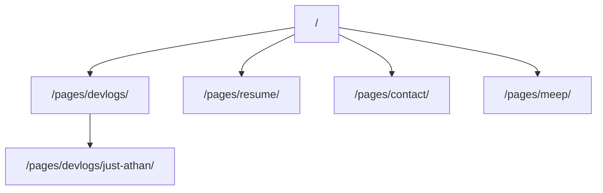

# Aloosi GitHub Pages

Personal site for [aloosi.ca](https://aloosi.ca), served from this repo as a static GitHub Pages site.

## Map

- [[Architecture]] — how pages, assets, and the MEAP subpage fit together
- [[Meep-Subpage]] — the Middle East Enterprise Projects site hosted at `/pages/meep/`

## Site surface

> [!tip]
> Shared chrome (header, nav, mobile toggle) lives in each HTML page plus `css/style.css` and `script.js`. The MEAP page is a standalone Vite build and does not use that chrome.
