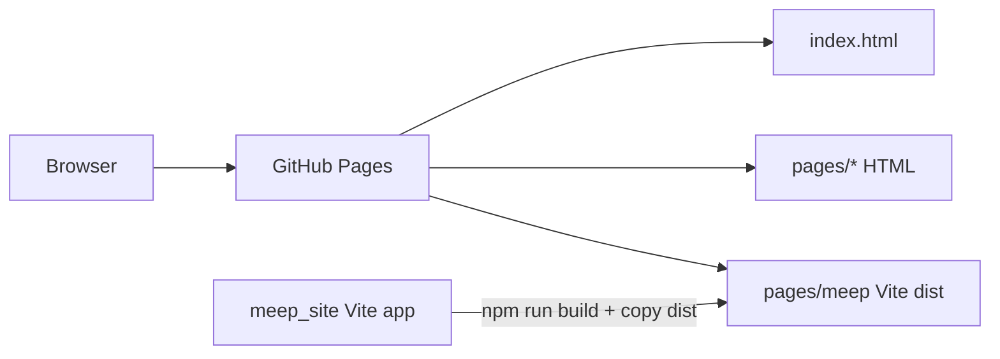

# Architecture

Back to [[00_Home]].

This repo is a static user site (`aloosi.github.io`) with a custom domain of `aloosi.ca`. GitHub Pages serves files as-is; there is no build step in this repo.

## Layout

| Path | Role |
| --- | --- |
| `index.html` | Home |
| `pages/devlogs/` | Project logs |
| `pages/resume/` | Resume |
| `pages/contact/` | Contact form |
| `pages/meep/` | [[Meep-Subpage]] production build |
| `css/` | Shared styles |
| `static/` | Images, resume PDF, favicon |

> [!tip]
> Rebuild MEAP from `../meep_site` (`npm run build`) then copy `dist/` into `pages/meep/`. The Vite config there uses `base: "./"` so asset URLs work under this subpath.
