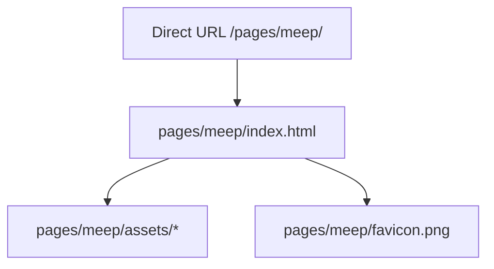

# Meep Subpage

Back to [[00_Home]] · see also [[Architecture]].

The MEAP (Middle East Enterprise Projects) marketing site is hosted as a separate subpage at:

- Live: `https://aloosi.ca/pages/meep/`
- In-repo: `pages/meep/`

It is a copied Vite production build, not the React source. Source remains in `../meep_site`.

The page is unlisted: it is not in the personal site nav. It is still a public GitHub Pages URL. The MEAP page keeps its own header, theme, and EN/AR locale switcher.

> [!tip]
> After editing the source app, run `npm run build` in `meep_site` and replace `pages/meep/` with the new `dist/` output.
